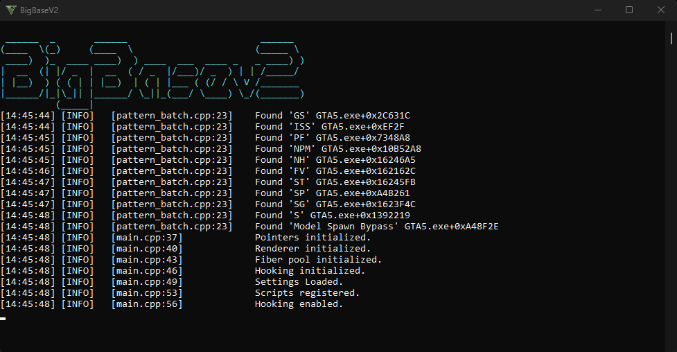
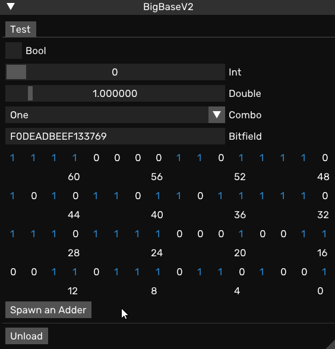

# BigBase-V2-Updated
BigBase V2 Imgui base for Grand Theft Auto V

# Element

- Fiber Pool
- Script Manager
- DX UI
- Hooking Detour, VMT
- Script
- Logger
- ImGui–based user interface
- Unloading at runtime
- Access to YSC script globals
- scrProgram–based native hook

# Update

- Updated Native
- Updated Crossmap
- Updated Pattern
- Updated Hooks

# Credit
- Updated By XIFI
- Pockaking Original Repository -> [Repository](https://github.com/Pocakking/BigBaseV2)

# Screen Shot

